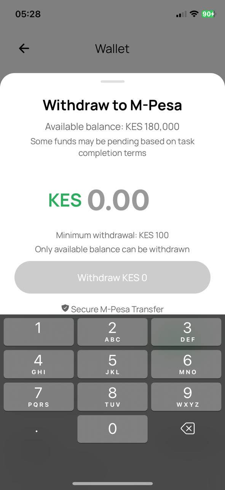
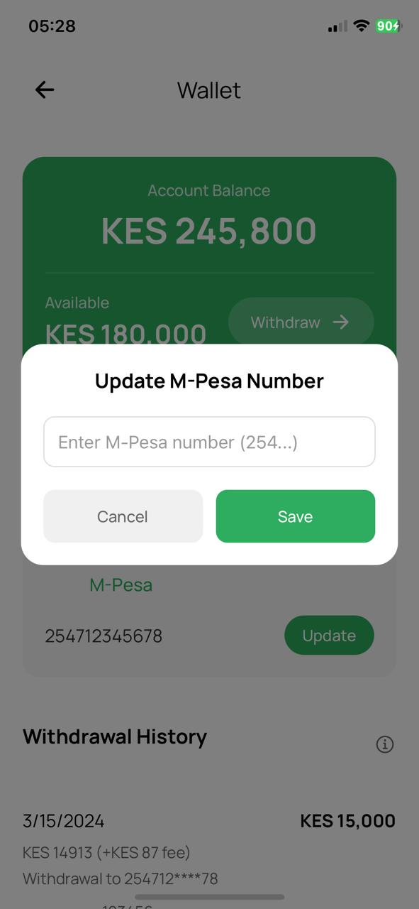
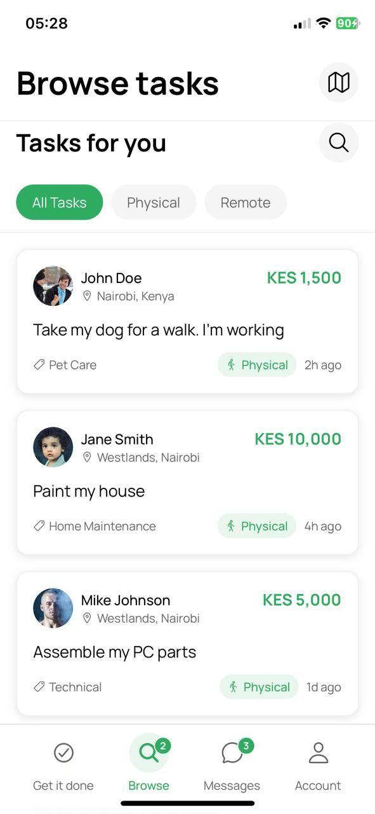
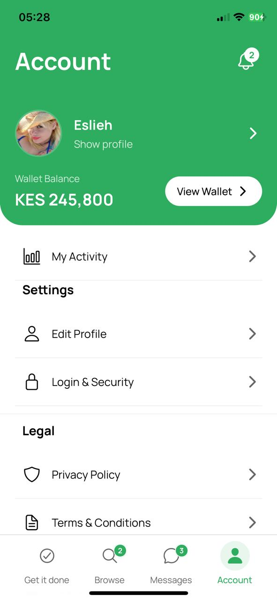

# DuoTasks Mobile Client

<div align="center">
  
  
  **A local marketplace connecting people with skills to those who need tasks done.**
  
  Post a task or service, connect instantly, and get paid — all within your community.

  [](https://expo.dev)
  [](https://reactnative.dev)
  [](https://www.typescriptlang.org)
</div>

---

## 📱 About

DuoTasks is a mobile application that bridges the gap between task posters and skilled taskers in local communities. Whether you need help with home repairs, deliveries, tutoring, or any other service, DuoTasks connects you with qualified individuals nearby who can get the job done.

### Key Features

- 🗺️ **Location-Based Matching** - Find taskers close to you using real-time geolocation
- 💼 **Task Marketplace** - Browse and post tasks in various categories
- 💰 **Bidding System** - Receive competitive bids from multiple taskers
- 💬 **Real-Time Messaging** - Chat with taskers and task posters instantly via Socket.IO
- 📍 **Interactive Maps** - View task locations and navigate with Google Maps integration
- 🔔 **Push Notifications** - Stay updated on bids, messages, and task status changes
- 💳 **Integrated Payments** - Secure payment processing with M-Pesa integration
- 👤 **User Profiles** - Build your reputation with ratings and reviews
- 🔐 **Secure Authentication** - Google OAuth and traditional email/password login
- 📊 **Task Management** - Track your posted tasks and assigned work
- 🌓 **Dark Mode Support** - Automatic theme switching based on system preferences

---

## 🛠️ Tech Stack

### Core Technologies
- **[Expo](https://expo.dev)** (v54.0.0) - React Native development platform
- **[React Native](https://reactnative.dev)** (v0.81.5) - Cross-platform mobile framework
- **[TypeScript](https://www.typescriptlang.org)** (v5.9.2) - Type-safe JavaScript
- **[Expo Router](https://docs.expo.dev/router/introduction/)** (v6.0.14) - File-based routing

### UI & Styling
- **[TailwindCSS](https://tailwindcss.com)** (v4.1.6) - Utility-first CSS framework
- **[Moti](https://moti.fyi)** - Animation library for React Native
- **[React Native Reanimated](https://docs.swmansion.com/react-native-reanimated/)** - Smooth animations
- **[Lucide Icons](https://lucide.dev)** - Beautiful icon library
- **[Expo Linear Gradient](https://docs.expo.dev/versions/latest/sdk/linear-gradient/)** - Gradient backgrounds

### Maps & Location
- **[React Native Maps](https://github.com/react-native-maps/react-native-maps)** - Interactive maps
- **[Expo Location](https://docs.expo.dev/versions/latest/sdk/location/)** - Geolocation services
- **[Google Places Autocomplete](https://github.com/FaridSafi/react-native-google-places-autocomplete)** - Location search

### Communication & Data
- **[Socket.IO Client](https://socket.io)** - Real-time messaging
- **[Axios](https://axios-http.com)** - HTTP client for API requests
- **[AsyncStorage](https://react-native-async-storage.github.io/async-storage/)** - Local data persistence

### Additional Features
- **[Expo Notifications](https://docs.expo.dev/versions/latest/sdk/notifications/)** - Push notifications
- **[Expo Image Picker](https://docs.expo.dev/versions/latest/sdk/imagepicker/)** - Photo uploads
- **[React Native QR Code](https://github.com/awesomejerry/react-native-qrcode-svg)** - QR code generation
- **[Bottom Sheet](https://gorhom.github.io/react-native-bottom-sheet/)** - Modal bottom sheets
- **[FlashList](https://shopify.github.io/flash-list/)** - Optimized list rendering

---

## 🚀 Getting Started

### Prerequisites

- **Node.js** (v18 or higher)
- **npm** or **yarn**
- **Expo CLI** (installed globally or via npx)
- **iOS Simulator** (macOS only) or **Android Emulator**
- **Expo Go** app (for testing on physical devices)

### Installation

1. **Clone the repository**
   ```bash
   git clone https://github.com/eslieh/duotask.git
   cd duotask
   ```

2. **Install dependencies**
   ```bash
   npm install
   ```

3. **Set up environment variables**
   
   Configure the following in `app.json`:
   - Google Maps API Key
   - API URLs (auth, main API)
   - Firebase configuration files (`GoogleService-Info.plist` for iOS, `google-services.json` for Android)

4. **Build Tailwind CSS**
   ```bash
   npm run build:tailwind
   ```

### Running the App

**Start the development server:**
```bash
npm start
# or
npx expo start
```

**Run on specific platforms:**
```bash
# iOS (macOS only)
npm run ios

# Android
npm run android

# Web
npm run web
```

**Development with Tailwind watch mode:**
```bash
npm run dev:tailwind
```

### Testing on Physical Devices

1. Install **Expo Go** from the App Store (iOS) or Google Play (Android)
2. Scan the QR code displayed in your terminal
3. The app will load on your device

---

## � Screenshots

<div align="center">
  
  
  
</div>

<div align="center">
  
  
</div>

---

## 🔑 Key Screens

### For Task Posters
- **Browse Tasks** - Discover available tasks in your area
- **Post Task** - Create new task listings with budget, location, and details
- **My Tasks** - Manage your posted tasks and view bids
- **Messages** - Communicate with taskers

### For Taskers
- **Browse Tasks** - Find tasks matching your skills
- **Bid on Tasks** - Submit competitive bids
- **Assigned Tasks** - Track your active assignments
- **Wallet** - Manage earnings and payments

### Shared Features
- **Profile** - View and edit your profile, ratings, and reviews
- **Notifications** - Stay updated on task activity
- **Settings** - Manage account, security, and preferences

---

## 🔐 Authentication

DuoTasks supports multiple authentication methods:

- **Email/Password** - Traditional signup and login
- **Google OAuth** - Quick sign-in with Google
- **Two-Factor Authentication** - Enhanced security (optional)
- **Email Verification** - Verify your account via email

---

## 🌍 API Integration

The app connects to the DuoTasks backend API:

- **Base API URL**: `https://api.duotasks.com`
- **Auth URL**: `https://auth.duotasks.com`
- **WebSocket**: Real-time messaging via Socket.IO

API configuration can be found in `app.json` under `expo.extra.duotasks`.

---

## 📦 Building for Production

### Android (APK/AAB)

```bash
# Build APK
eas build --platform android --profile preview

# Build AAB for Google Play
eas build --platform android --profile production
```

### iOS (IPA)

```bash
# Build for TestFlight/App Store
eas build --platform ios --profile production
```

> **Note**: You'll need an [Expo Application Services (EAS)](https://expo.dev/eas) account for production builds.

---

## 🧪 Development Scripts

| Command | Description |
|---------|-------------|
| `npm start` | Start Expo development server |
| `npm run android` | Run on Android emulator/device |
| `npm run ios` | Run on iOS simulator (macOS only) |
| `npm run web` | Run in web browser |
| `npm run lint` | Run ESLint |
| `npm run build:tailwind` | Build Tailwind CSS |
| `npm run dev:tailwind` | Watch mode for Tailwind CSS |

---

## 🤝 Contributing

Contributions are welcome! Please follow these steps:

1. Fork the repository
2. Create a feature branch (`git checkout -b feature/amazing-feature`)
3. Commit your changes (`git commit -m 'Add amazing feature'`)
4. Push to the branch (`git push origin feature/amazing-feature`)
5. Open a Pull Request

---

## 📄 License

This project is proprietary software. All rights reserved.

---

## 📞 Support

- **Email**: [Support Email](mailto:support@duotasks.com)
- **Website**: [https://duotasks.com](https://duotasks.com)
- **Support Portal**: [https://support.duotasks.com](https://support.duotasks.com)

---

## 🙏 Acknowledgments

- Built with [Expo](https://expo.dev)
- Icons by [Lucide](https://lucide.dev)
- Maps powered by [Google Maps](https://developers.google.com/maps)
- Real-time messaging with [Socket.IO](https://socket.io)

---

<div align="center">
  Made with ❤️ by the DuoTasks Team
</div>
